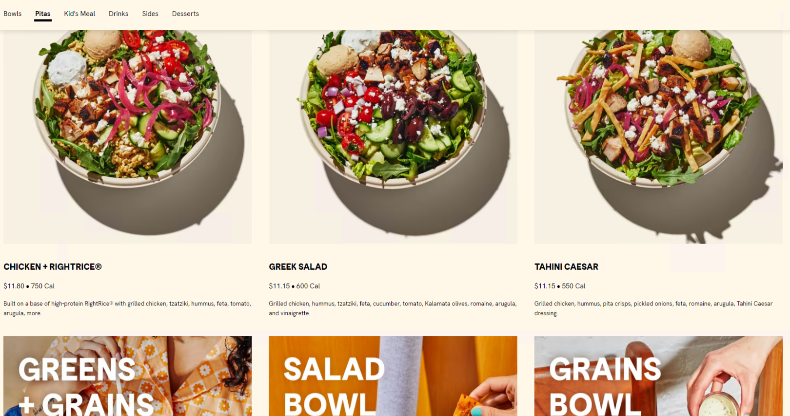

# 🍽️ Cava - Restaurant Web Scraping Project 🍽️

This is a Python based web scraping project utilizing Selenium to fetch information about various aspects of our favorite restaurant - Cava. 🥙🌯🥗

## Technology behind the magic wand 🔮

**Web Scraping:** It's a mechanism used to extract large amounts of data from websites whereby the data is extracted and saved to a local file in your system. 💾🗄️

**Python:** Python is our magic spell for this task. It is a general-purpose coding language that is not only for web development but also can be used for data science, writing system scripts, etc. 🐍

**Selenium:** It's our magic wand, an open-source tool that automates web browsers. It provides a single interface that lets you write automation scripts in your favorite language, like Python. 🎩🐇

**Anti-bot systems:** Remember those hard-to-decipher bit of text you've to input to prove you're human? Those are CAPTCHAs, an acronym for Completely Automated Public Turing test to tell Computers and Humans Apart. 🦹‍♂️👾

We come battle-ready with shields against anti-bot systems and CAPTCHAs, ensuring smooth scraping operations even against those pesky protection systems. 🛡️⚔️

## Usage 🎯

Welcome aboard this adventurous foodie journey with Cava! Now save your time sorting and searching for menus, reviews, and ratings with our scraper.

**More instructions here...**

## Contribute 🤝

Contributions, issues, and feature requests are welcome! Feel free to check [issues page](<Your Issues Page Link>).

## 🍔🌮 Happy Scraping & Bon Appétit! 🍣🍜

---

### ©️2022 Your Name

---
